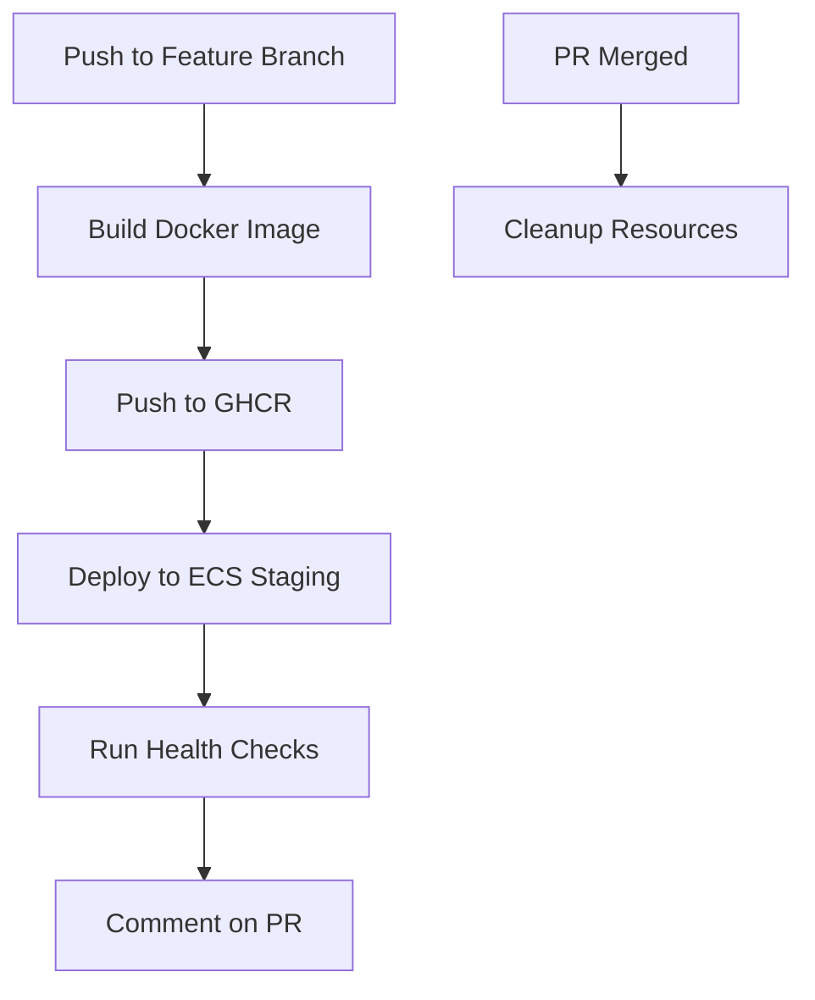
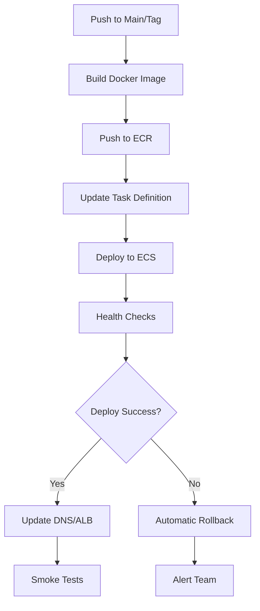

# Deployment Guide

This document provides comprehensive instructions for deploying the Theobroma Geo API to AWS ECS using GitHub Actions.

## 🏗️ Architecture Overview

### Deployment Environments

- **Development**: Local development using Docker Compose
- **Staging**: Feature branch deployments on AWS ECS with temporary environments  
- **Production**: Main branch deployments on AWS ECS with blue-green deployment

### AWS Infrastructure

```
┌─────────────────┐    ┌─────────────────┐    ┌─────────────────┐
│   Application   │    │     Database    │    │   Load Balancer │
│   Load Balancer │◄───┤   PostgreSQL    │    │      (ALB)      │
│      (ALB)      │    │   with PostGIS  │    │                 │
└─────────────────┘    └─────────────────┘    └─────────────────┘
         │                        │                        │
         ▼                        ▼                        ▼
┌─────────────────┐    ┌─────────────────┐    ┌─────────────────┐
│   ECS Cluster   │    │   RDS Instance  │    │    Route 53     │
│   (Fargate)     │    │   Multi-AZ      │    │   DNS Records   │
│                 │    │                 │    │                 │
└─────────────────┘    └─────────────────┘    └─────────────────┘
```

## 🔧 Prerequisites

### AWS Resources Required

1. **ECS Cluster**: `theobroma-production` and `theobroma-staging`
2. **ECR Repository**: `theobroma-geo-api`
3. **RDS Instance**: PostgreSQL with PostGIS extension
4. **VPC with Subnets**: Public and private subnets
5. **Application Load Balancer**: For routing traffic
6. **IAM Roles**: ECS task execution and service roles
7. **CloudWatch**: Log groups for container logging

### GitHub Secrets Required

Configure the following secrets in your GitHub repository:

#### AWS Credentials
```bash
AWS_ACCESS_KEY_ID           # AWS access key for deployment
AWS_SECRET_ACCESS_KEY       # AWS secret key for deployment  
AWS_REGION                  # AWS region (e.g., us-east-1)
AWS_ACCOUNT_ID              # AWS account ID for ECR/IAM resources
```

#### Database Credentials
```bash
STAGING_DB_PASSWORD         # Password for staging database
PRODUCTION_DB_PASSWORD      # Password for production database
```

#### Network Configuration
```bash
SUBNET_IDS                  # Comma-separated subnet IDs for ECS
SECURITY_GROUP_ID           # Security group ID for ECS tasks
STAGING_TARGET_GROUP_ARN    # Target group ARN for staging ALB
PRODUCTION_TARGET_GROUP_ARN # Target group ARN for production ALB
```

## 🚀 Deployment Workflows

### 1. CI Workflow (`.github/workflows/ci.yml`)

**Triggers**: Push to `main` or `develop`, Pull Requests  
**Purpose**: Code quality, testing, and Docker image validation

**Steps**:
- Code formatting checks (Black, isort)
- Linting (flake8, bandit)
- Unit tests with PostgreSQL
- Docker image build and security scanning
- Performance tests

### 2. Staging Deployment (`.github/workflows/deploy-staging.yml`)

**Triggers**: Push to `feature/*`, `hotfix/*`, `develop` branches  
**Purpose**: Deploy feature branches to temporary staging environments

**Features**:
- Builds and pushes Docker image to GHCR
- Creates/updates ECS service with branch-specific naming
- Automatic environment cleanup on PR merge
- Health checks and integration tests
- PR comments with deployment info

**Deployment Flow**:


### 3. Production Deployment (`.github/workflows/deploy-production.yml`)

**Triggers**: Push to `main`, Git tags (`v*`)  
**Purpose**: Deploy to production with rollback capabilities

**Features**:
- Builds and pushes Docker image to ECR
- Blue-green deployment strategy
- Automatic rollback on failure
- Comprehensive health checks and smoke tests
- Production monitoring integration

**Deployment Flow**:


## 🛠️ Infrastructure Setup

### 1. AWS ECS Cluster Setup

```bash
# Create ECS clusters
aws ecs create-cluster --cluster-name theobroma-production
aws ecs create-cluster --cluster-name theobroma-staging

# Create ECR repository
aws ecr create-repository --repository-name theobroma-geo-api
```

### 2. Task Definition Template

The workflows automatically generate task definitions with the following structure:

```json
{
  "family": "theobroma-geo-api-task",
  "networkMode": "awsvpc",
  "requiresCompatibilities": ["FARGATE"],
  "cpu": "256",
  "memory": "512",
  "executionRoleArn": "arn:aws:iam::ACCOUNT:role/ecsTaskExecutionRole",
  "containerDefinitions": [
    {
      "name": "theobroma-geo-api",
      "image": "ACCOUNT.dkr.ecr.REGION.amazonaws.com/theobroma-geo-api:TAG",
      "portMappings": [
        {
          "containerPort": 8000,
          "protocol": "tcp"
        }
      ],
      "environment": [
        {
          "name": "DATABASE_URL",
          "value": "postgresql://..."
        },
        {
          "name": "ENVIRONMENT",
          "value": "production"
        }
      ],
      "logConfiguration": {
        "logDriver": "awslogs",
        "options": {
          "awslogs-group": "/ecs/theobroma-geo-api",
          "awslogs-region": "us-east-1",
          "awslogs-stream-prefix": "ecs"
        }
      }
    }
  ]
}
```

### 3. IAM Roles Required

#### ECS Task Execution Role
```json
{
  "Version": "2012-10-17",
  "Statement": [
    {
      "Effect": "Allow",
      "Action": [
        "ecr:GetAuthorizationToken",
        "ecr:BatchCheckLayerAvailability",
        "ecr:GetDownloadUrlForLayer",
        "ecr:BatchGetImage",
        "logs:CreateLogStream",
        "logs:PutLogEvents"
      ],
      "Resource": "*"
    }
  ]
}
```

#### GitHub Actions Deployment Role
```json
{
  "Version": "2012-10-17",
  "Statement": [
    {
      "Effect": "Allow",
      "Action": [
        "ecs:*",
        "ecr:*",
        "logs:*",
        "elbv2:*"
      ],
      "Resource": "*"
    }
  ]
}
```

## 🔄 Deployment Process

### Staging Deployment

1. **Create Feature Branch**: `feature/new-api-endpoint`
2. **Push Changes**: Triggers staging deployment workflow
3. **Automatic Deployment**: 
   - Builds Docker image
   - Creates ECS service: `staging-feature-new-api-endpoint`
   - Deploys to `https://staging-feature-new-api-endpoint.theobroma-api.dev`
4. **Testing**: Use PR environment for testing
5. **Cleanup**: Merge PR to automatically cleanup resources

### Production Deployment

1. **Merge to Main**: Triggers production deployment
2. **Automatic Deployment**:
   - Builds and pushes to ECR
   - Updates production ECS service
   - Runs health checks and smoke tests
3. **Rollback if Needed**: Automatic rollback on failure
4. **Monitoring**: Check CloudWatch and application metrics

## 📊 Monitoring and Logging

### CloudWatch Integration

- **Container Logs**: `/ecs/theobroma-geo-api`  
- **Application Metrics**: Custom metrics via CloudWatch
- **Health Check Monitoring**: ALB health checks

### Health Check Endpoints

- `GET /health` - Basic health check
- `GET /health/detailed` - Detailed system status  
- `GET /metrics` - Prometheus metrics (if enabled)

### Monitoring Dashboards

Create CloudWatch dashboards to monitor:
- ECS service CPU/Memory usage
- Database connection pool status
- API response times and error rates
- Geographic query performance

## 🚨 Troubleshooting

### Common Issues

#### 1. Task Startup Failures
```bash
# Check ECS service logs
aws logs get-log-events --log-group-name "/ecs/theobroma-geo-api" \
  --log-stream-name "ecs/theobroma-geo-api/TASK_ID"
```

#### 2. Database Connection Issues
- Verify security groups allow connection from ECS to RDS
- Check database credentials in environment variables
- Ensure RDS instance is in running state

#### 3. Load Balancer Health Check Failures
- Verify application starts on port 8000
- Check health endpoint returns 200 status
- Review ALB target group configuration

### Rollback Procedures

#### Manual Rollback
```bash
# List task definition revisions
aws ecs list-task-definitions --family-prefix theobroma-geo-api-task

# Rollback to previous revision
aws ecs update-service \
  --cluster theobroma-production \
  --service theobroma-geo-api-service \
  --task-definition theobroma-geo-api-task:PREVIOUS_REVISION
```

#### Emergency Rollback
The production workflow includes automatic rollback on deployment failure:
- Detects failed health checks
- Automatically reverts to previous task definition
- Alerts team via configured notifications

## 📈 Scaling and Performance

### Auto Scaling Configuration

```bash
# Create auto scaling target
aws application-autoscaling register-scalable-target \
  --service-namespace ecs \
  --scalable-dimension ecs:service:DesiredCount \
  --resource-id service/theobroma-production/theobroma-geo-api-service \
  --min-capacity 2 \
  --max-capacity 10

# Create CPU-based scaling policy
aws application-autoscaling put-scaling-policy \
  --service-namespace ecs \
  --scalable-dimension ecs:service:DesiredCount \
  --resource-id service/theobroma-production/theobroma-geo-api-service \
  --policy-name cpu-scaling \
  --policy-type TargetTrackingScaling \
  --target-tracking-scaling-policy-configuration '{
    "TargetValue": 70.0,
    "PredefinedMetricSpecification": {
      "PredefinedMetricType": "ECSServiceAverageCPUUtilization"
    }
  }'
```

### Performance Optimization

- **Task Resources**: Adjust CPU/Memory based on load testing
- **Database Connection Pooling**: Configure appropriate pool sizes
- **Geographic Indexing**: Ensure PostGIS indexes are optimized
- **Caching**: Implement Redis/ElastiCache for frequently accessed data

## 🔒 Security Considerations

### Container Security
- Use minimal base images (Python slim)
- Run containers as non-root user
- Regular vulnerability scanning with Trivy
- Secrets managed via AWS Secrets Manager

### Network Security
- ECS tasks in private subnets
- ALB in public subnets
- Security groups with minimal required access
- Database in private subnets with restricted access

### Compliance
- All deployments logged and auditable
- Environment variable encryption
- Regular security assessments
- GDPR/data protection compliance

---

## 🆘 Support

For deployment issues or questions:
- Check GitHub Actions logs
- Review CloudWatch logs
- Create issue in repository
- Contact DevOps team

**Emergency Contact**: devops@theobroma.digital  
**Monitoring Dashboard**: https://cloudwatch.aws.amazon.com/dashboard/theobroma
